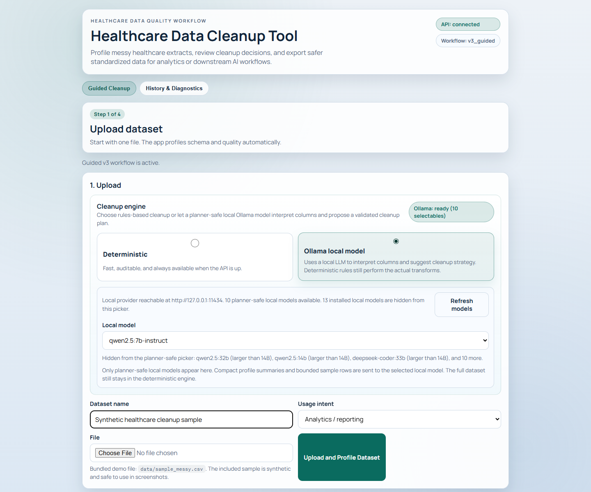
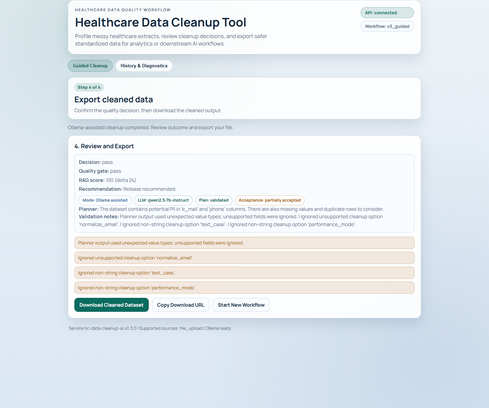
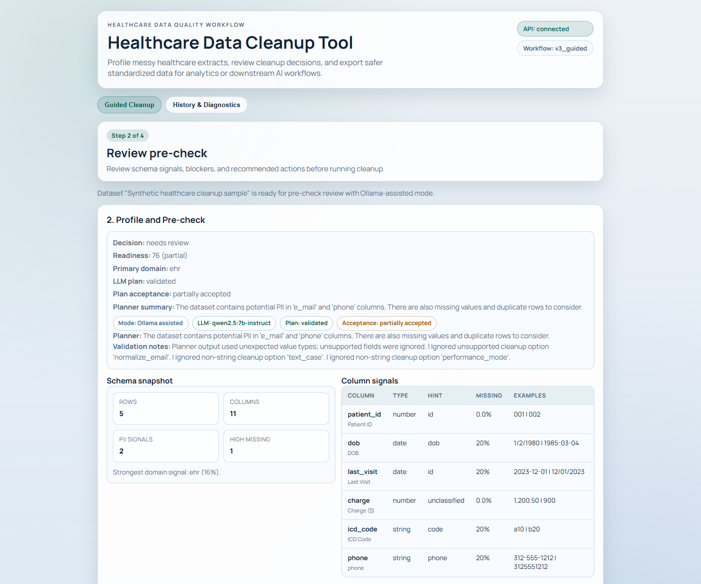
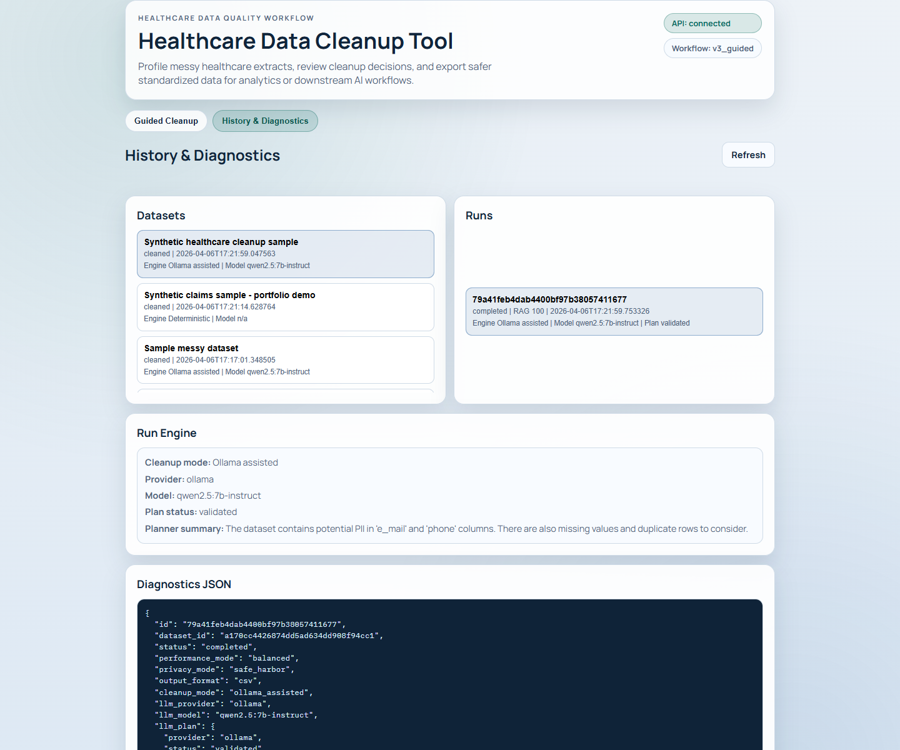

# Healthcare Data Cleanup Tool

Guided healthcare dataset cleanup with schema profiling, deterministic normalization, and optional local Ollama-assisted planning.

| Guided upload and engine selection | Profile, cleanup, and export |
| --- | --- |
|  |  |

| Schema and pre-check view | Export and quality summary |
| --- | --- |
|  |  |

## What This Product Does

This app helps operators clean up messy healthcare datasets before they are used for analytics, reporting, or downstream AI workflows. It walks the user through a guided flow:

1. Upload a local CSV, TSV, JSONL, or Parquet file.
2. Profile schema quality, likely field meaning, domain signals, and data quality risks.
3. Run deterministic cleanup with optional local LLM-assisted planning through Ollama.
4. Review quality outputs and export a cleaner dataset.

The product is intentionally local-first and demo-safe. The bundled sample data is synthetic, and the app does not require cloud services to demonstrate the core workflow.

## The Problem It Solves

Healthcare data exports are often inconsistent before they reach analytics teams or AI pipelines. Fields drift, dates arrive in mixed formats, phones and ZIP codes are messy, duplicate rows appear, and risky values may be buried in free text. This tool makes those issues visible, proposes a cleanup strategy, and keeps the final transforms understandable and reviewable.

## Who It Is For

- Product managers and platform teams shaping healthcare data workflows
- Data engineers and analytics engineers preparing inputs for reporting or AI
- Operators who need a fast, reviewable cleanup path without sending data to a cloud service
- Interviewers validating product thinking, workflow design, and technical fluency

## Why It Stands Out

- Guided workflow instead of a cluttered data workbench
- Honest AI positioning: Ollama assists with planning, while deterministic rules execute the final cleanup
- Healthcare-specific profiling signals for claims, EHR, labs, and pharmacy-style datasets
- Local-first packaging with a one-click Windows launcher and explicit health checks
- Clear trust story: quality checks, run history, diagnostics, and public-safe sample data

## 60-Second Demo Path

1. Run `.\RUN_HCDATA_1_CLICK.cmd` from the repo root.
2. In the app, keep `Deterministic` selected for the fastest path or choose `Ollama local model` if Ollama is already running.
3. Upload `data/sample_messy.csv`.
4. Show the pre-check summary and top blockers.
5. Run guided cleanup.
6. Show the final quality summary and download link.
7. Optional: open `History & Diagnostics` to show run traceability and engine metadata.

The exact live script is in [docs/DEMO-SCRIPT.md](docs/DEMO-SCRIPT.md).

## Core Workflows

### Guided cleanup

- Upload a local healthcare-style dataset
- Inspect pre-check readiness, blockers, and recommended actions
- Run cleanup with deterministic execution and optional Ollama-assisted planning
- Export a cleaned dataset for analytics or downstream AI workflows

### Diagnostics and traceability

- Review dataset and run history
- Inspect cleanup mode, model metadata, and plan status
- See quality outputs and diagnostics JSON for each run

### Local LLM assistance

- The app can call a local Ollama model to interpret columns and suggest cleanup options
- Only compact profile context and bounded sample rows are sent to the model
- The full dataset stays in the deterministic engine for the actual transforms

## Architecture And Data Handling

The frontend is a static guided UI served by FastAPI. The backend handles file upload, profiling, cleanup orchestration, export, and run history. SQLite stores local metadata for datasets and runs, while cleaned files are written to local disk.

The profiling layer infers primitive types, semantic hints, domain signals, missingness, and basic PII indicators. When Ollama-assisted mode is selected, the backend asks a local model for a structured cleanup plan, validates the response server-side, and merges only supported directives into the deterministic cleanup path.

## Tech Stack

- **FastAPI**: Serves the API, workflow routes, provider discovery, and the static frontend from a single local app.
- **Pandas**: Powers dataset profiling, normalization, and QC-oriented cleanup logic on local files.
- **SQLite + SQLAlchemy**: Stores dataset metadata, run history, and diagnostics so workflows remain inspectable after each run.
- **Vanilla JavaScript + CSS**: Keeps the UI lightweight, direct, and easy to demo without a frontend build pipeline.
- **Ollama**: Provides an optional local LLM for cleanup planning without making cloud model access a requirement.
- **PowerShell launch scripts**: Deliver one-click startup, health checks, and smoke-path validation on Windows.

## Run Locally

### One-click Windows path

```powershell
.\RUN_HCDATA_1_CLICK.cmd
```

The launcher bootstraps `.venv`, installs backend dependencies if needed, starts the app on an available local port, checks `/api/health`, probes Ollama, and opens the browser.

### Developer commands

```powershell
.\scripts\dev.ps1
.\scripts\run_tests.ps1
.\scripts\test_tool.ps1 -BaseUrl http://127.0.0.1:8000
```

### Optional Ollama setup

```powershell
ollama serve
ollama list
```

If Ollama is not running, the app still works in deterministic mode.

## Demo Dataset And Sample Data

- Primary sample: `data/sample_messy.csv`
- The included sample is synthetic and safe for screenshots, demos, and public repo artifacts
- The demo path is designed around local file upload rather than cloud connectors

If you want to try the LLM-assisted path, start Ollama first and choose a planner-safe local model from the dropdown. Oversized, embedding, and vision models are intentionally hidden from the picker.

## Product Decisions And Tradeoffs

- **Deterministic execution over freeform rewriting**: the LLM proposes a plan, but the actual cleanup stays auditable and rule-based.
- **File upload as the primary source**: this keeps the main demo path reliable and easy to understand. Cloud connectors are not the center of the public repo story.
- **Guided workflow over feature sprawl**: the app optimizes for a bounded operator flow instead of a large exploratory dashboard.
- **Local-first by default**: SQLite, local files, and local Ollama reduce setup friction and keep the trust model easy to explain.

## Roadmap

- Stronger before-and-after field-level explainability for cleanup decisions
- More domain-specific rule packs for claims, labs, and pharmacy datasets
- Better schema contract and drift handling across repeated uploads
- Richer export summaries for analytics and downstream AI handoff

## Supporting Docs

- [Case study](docs/CASE-STUDY.md)
- [60-second demo script](docs/DEMO-SCRIPT.md)
- [Resume and LinkedIn bullets](docs/RESUME-BULLETS.md)
- [Publish steps and GitHub metadata](docs/PUBLISH-STEPS.md)
- [Product history](docs/product-history/README.md)

## License

[MIT](LICENSE)
